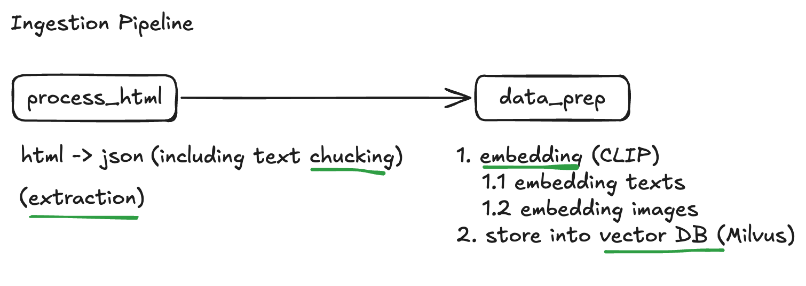
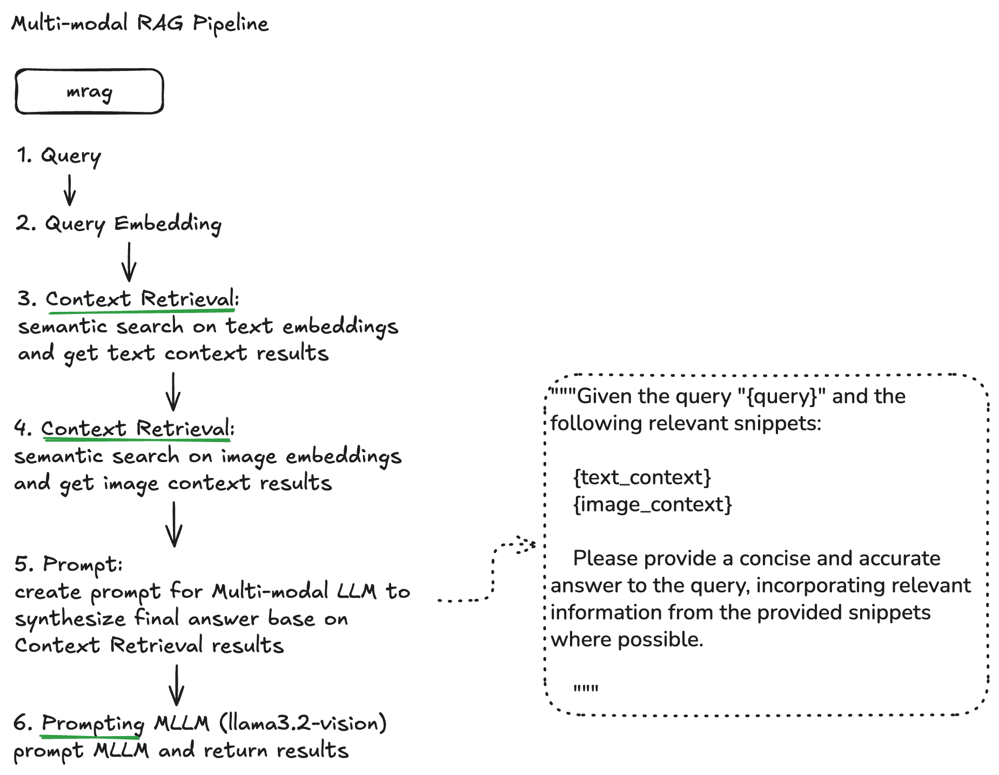
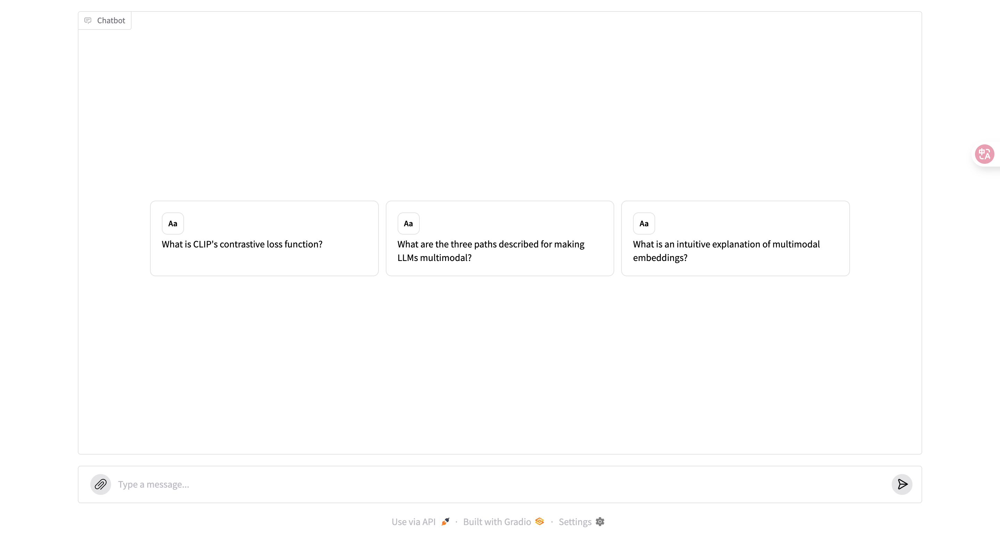
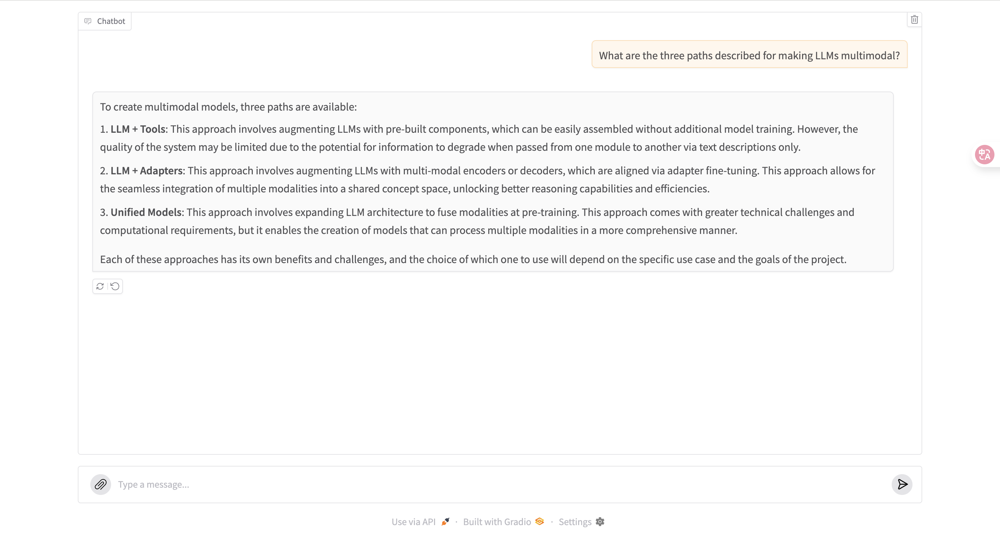

# Multi-modal blog QA Assistant

Multi-modal blog QA Assistant prototype implemented using Multi-modal RAG techniques(Python, CLIP, Milvus, Ollama, llama3.2-vision).

## Features
- Supported type: **HTML** blog
- **Vector embeddings** with semantic search for **text** and **image**
- **Multi-modal RAG** with llama3.2-vision
- **Frontend-ready** using Gradio

## Architecture
### Data Ingestion Pipeline


### Multi-modal RAG Pipeline


### JSON format
**Text content**
```json
[
    {
        "article_title": "Multimodal Embeddings: An Introduction",
        "section": "Multimodal Embeddings: An Introduction",
        "text": "This is the 2nd article in a larger series on multimodal AI. ...."
    },
]
```
**Image content**
```json
[
    {
        "article_title": "Multimodal Embeddings: An Introduction",
        "section": "Multimodal Embeddings: An Introduction",
        "image_path": "/home/ubuntu/workspace/multimodal_rag/data/images/1*a6BF-kEeo8rd7OW2a3JYGA.png",
        "caption": "Image from Canva."
    },
]
```

### Database Collections
**Text collection**
```python
text_col_fields = [
        FieldSchema(name="id", dtype=DataType.INT64, is_primary=True, auto_id=True),
        FieldSchema(name="article_title", dtype=DataType.VARCHAR, max_length=512),
        FieldSchema(name="section", dtype=DataType.VARCHAR, max_length=256),
        FieldSchema(name="text", dtype=DataType.VARCHAR, max_length=256),
        FieldSchema(name="vector", dtype=DataType.FLOAT_VECTOR, dim=embedding_dim)
    ]
```

**Image collection**
```python
image_col_fields = [
        FieldSchema(name="id", dtype=DataType.INT64, is_primary=True, auto_id=True),
        FieldSchema(name="article_title", dtype=DataType.VARCHAR, max_length=512),
        FieldSchema(name="section", dtype=DataType.VARCHAR, max_length=256),
        FieldSchema(name="image_path", dtype=DataType.VARCHAR,  max_length=512),
        FieldSchema(name="caption", dtype=DataType.VARCHAR,  max_length=512),
        FieldSchema(name="vector", dtype=DataType.FLOAT_VECTOR, dim=embedding_dim)
    ]
```

## Examples
**Landing Page**


**Example**


## Quick Start Guide
TO BE ADDED..

## License
This project is licensed under the MIT License - see the [LICENSE](./LICENSE)
